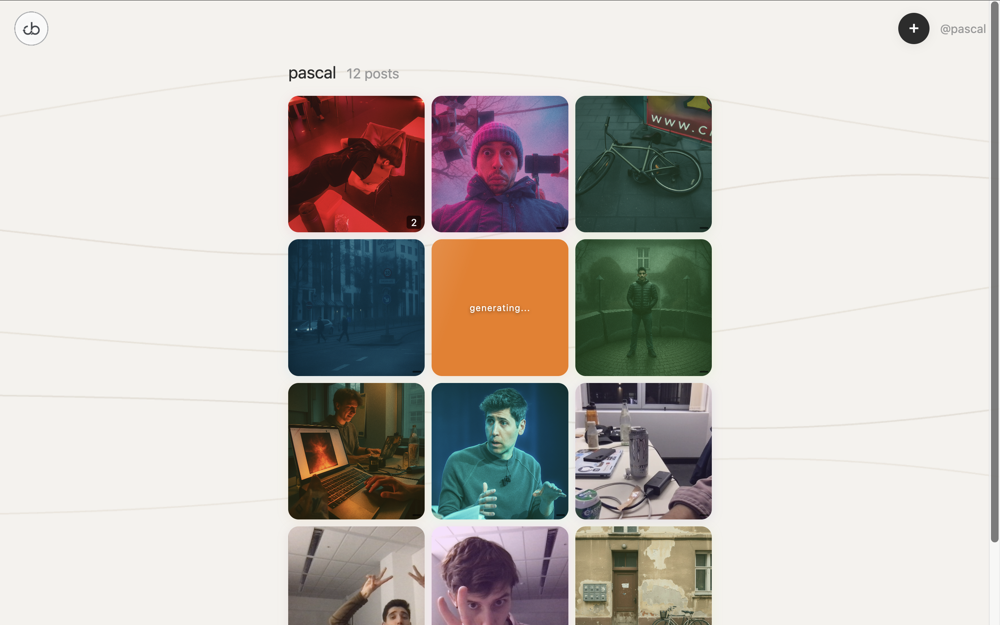

<p align="center">
  
</p>

<h1 align="center">re:be</h1>

<p align="center">
  <em>Every image has a sound. Every gesture has a rhythm. Every moment deserves a soundtrack.</em>
</p>

---

## The Vision

There's music hiding in every moment — the amber warmth of a sunset photograph, the chaotic energy of a crowded street, the quiet stillness of an empty room. We just don't have the tools to hear it yet.

<p align="center">
  <em>Creation flow — capture, gesture, generate</em>
</p>

<p align="center">
  
  <br />
  <em>Feed — color-tinted cards with waveform players and BPM-synced particles</em>
</p>

<p align="center">
  
  <br />
  <em>Profile — user profile with paginated posts</em>
</p>

**re:be** is a synthetic engine that translates visual moments into sound. Upload any image, draw a gesture across it, and watch as a 6-stage AI pipeline decodes the scene's hidden musicality — its mood, its rhythm, its texture — and composes an original soundtrack in seconds. The gesture isn't decoration; it's a conductor's baton, shaping tempo, energy, and density through speed, scale, and direction.

But re:be isn't a one-shot generator. It's a **social instrument**. Every post becomes a musical thread. Comments inherit the parent's BPM, key, and duration, then choose to *mirror*, *vary*, or *contrast* — creating a creative flywheel where music responds to music and audiences shape the composition together. This is the multimodal-to-music backbone: not generating audio in isolation, but building infrastructure where visual input, gestural expression, and AI composition form a living, collaborative loop.

---

## How It Works

1. **Capture** — Snap a photo or upload any image. The moment you want to hear.
2. **Draw** — Trace a gesture across the image. Fast and wide for energy; slow and tight for calm. Your squiggle's endpoint on a radial color wheel selects the tonal palette.
3. **Generate** — A 6-stage AI pipeline decodes the image, quantifies your gesture, maps your color, and composes an original instrumental track. A parallel branch morphs your image into gesture-driven art.
4. **Listen** — Your image now has a soundtrack. Waveform visualization pulses with the audio, particles dance to the BPM, and your morphed image glows with color.
5. **Respond** — Others reply with their own image-audio comments, locked to your track's BPM, key, and duration. Mirror it. Vary it. Contrast it. The thread becomes a collaborative composition.

---

## The AI Pipeline

The core of re:be is a 6-stage pipeline that translates three input signals — image, gesture, and color — into a composed audio track and a morphed image. Two branches run in parallel via `asyncio.gather()`.

```
                         ┌─────────────────────────────────────────┐
  Image ─────────────────┤  1. Synesthetic Vision Analysis (GPT)   │
                         └──────────────┬──────────────────────────┘
                                        │
  Gesture ───── 2. Squiggle Math ───────┤
                                        │
  Color ─────── 3. Color Theory ────────┤
                                        ▼
                         ┌──────────────────────────────────────────┐
                         │  4. Structured Audio Object (GPT)        │
                         └──────────────┬───────────────────────────┘
                                        │
                          ┌─────────────┴─────────────┐
                          ▼                           ▼
               ┌────────────────────┐    ┌──────────────────────────┐
               │ 5. Prompt Compile  │    │ 6a. Image Morph (DALL-E) │
               └────────┬───────────┘    └──────────────────────────┘
                        ▼
               ┌────────────────────┐
               │ 6b. Audio Generate │
               │  (ElevenLabs)      │
               └────────────────────┘
```

### Stage 1: Synesthetic Vision Analysis

OpenAI Vision (GPT-5.2) receives the uploaded image with a synesthetic analyst system prompt and extracts structured scene data at temperature 0.4.

**Output fields:**

| Field | Example |
|---|---|
| `scene_description` | *"A rain-streaked window overlooking a neon-lit Tokyo alley at dusk"* |
| `vibe` | *"hazy golden intimacy"* |
| `emotion` | *"bittersweet longing"* |
| `sonic_metaphor` | *"A cello note sustained underwater"* |
| `ambient_sound_associations` | *["rain on glass", "distant traffic hum", "flickering neon buzz", "muffled footsteps", "subway rumble"]* |
| `dominant_colors` | *["deep indigo", "warm amber", "neon pink"]* |
| `environment` | *"indoor"* |
| `time_of_day` | *"dusk"* |

### Stage 2: Gesture Mathematics

The squiggle gesture — a sequence of `{x, y, t}` points normalized to `[0, 1]` with millisecond timestamps — is analyzed for rhythmic character.

| Feature | Algorithm | What It Drives |
|---|---|---|
| `total_length` | Cumulative Euclidean distance: `Σ√((x₂-x₁)² + (y₂-y₁)²)` | Texture complexity |
| `bounding_box_area` | `(max_x - min_x) × (max_y - min_y)` | Density |
| `average_speed` | `total_length / total_time_ms` | Tempo |
| `speed_variance` | `Σ(speedᵢ - avg)² / n` | Rhythmic unpredictability |
| `point_count` | Raw sample count | Gesture resolution |

**Mapping thresholds:** `avg_speed > 0.003` → fast tempo · `bbox_area > 0.2` → dense arrangement · `total_length > 2.0` → complex textures

### Stage 3: Color Theory

The squiggle's endpoint on the canvas maps to a **radial color wheel** — angle determines hue, distance from center determines saturation:

```
angle = atan2(y - 0.5, x - 0.5)
hue = (angle × 180/π + 360) mod 360
saturation = min(distance_from_center / 0.5, 1.0)
```

The resulting HSL color is classified into one of **9 tonal categories** — `warm_red`, `warm_orange`, `warm_yellow`, `cool_green`, `cool_cyan`, `cool_blue`, `cool_purple`, `warm_magenta`, `neutral_gray` — each carrying distinct mood and instrument associations into the structured generation.

### Stage 4: Structured Audio Object

GPT-5.2 receives the image analysis, squiggle features, and color data with a multi-priority mapping system (temperature 0.6) and produces a structured `AudioStructuredObject`:

```
audio_type        → music | ambient | hybrid
mood              → { primary, secondary }
energy            → 0.0–1.0 (compressed: 0.3 + raw × 0.7, never boring)
tempo             → slow | medium | fast
density           → sparse | medium | dense
texture           → ["shimmering pads", "vinyl crackle"]
bpm               → 30–300
musical_key       → "Bb minor"
instruments       → ["muted trumpet", "upright bass", "brush drums"]
genre_hint        → "lo-fi jazz noir"
harmonic_mood     → "melancholic seventh chords"
dynamic_shape     → "slow build to gentle climax"
sonic_palette     → "warm analog, tape-saturated"
sound_references  → ["Bohren & der Club of Gore", "Nujabes"]
duration_seconds  → 15–20
confidence        → 0.0–1.0
```

**Priority cascade:** Image analysis (highest) → Color mood → Squiggle dynamics (fine-grained). Energy is biased upward — "never boring or flat" — avoiding values below 0.3 and favoring medium-to-fast tempos.

### Stage 5: Prompt Compilation

All signals are fused into a dense natural-language prompt for the audio model. The compiler:

1. Opens with genre hint + scene description for context
2. Layers in sonic metaphor, energy descriptor, mood, color tone, texture, and rhythm
3. Specifies 2–4 instruments, timbre (sonic palette), harmonic mood, and dynamic shape
4. Adds up to 6 sound references for stylistic anchoring
5. Appends engagement directive: *"Make it musically engaging with clear rhythm and forward momentum"*
6. Closes with strict constraints: exact BPM, key, tempo, density, duration, *"Instrumental only, no vocals, no lyrics"*

### Stage 6a: Image Morphing (Parallel)

Running simultaneously with audio generation:

1. **Enhancement prompt generation** (GPT, temperature 0.85) — maps the image's emotion to one of 25+ visual styles across 6 emotion categories (glitch, noir, pop art, impressionist, etc.), producing an `emotional_intent`, `visual_directive`, `morphing_prompt`, and `style_reference`
2. **Image transformation** (DALL-E `gpt-image-1`) — applies a semi-transparent color overlay (10–30% opacity based on saturation), then morphs via `images.edit` with the generated prompt

### Stage 6b: Audio Generation

The compiled prompt is sent to the **ElevenLabs Music API** in a two-step process:

1. **Composition Plan** (`/v1/music/plan`) — the model plans the musical structure given the prompt, duration, and `force_instrumental=true`
2. **Audio Generation** (`/v1/music`) — the plan is realized into an instrumental MP3

Timeouts: 60s for planning, 120s for generation. Output is saved as `{post_id}.mp3`.

---

## Conversational Music

Comments aren't just reactions — they're **musical responses**. When someone replies to a post, the AI pipeline receives the parent's structured audio object and enforces:

- **Same BPM** — rhythms lock together
- **Same key** — harmonies align
- **Same duration** — tracks loop in sync

The commenter's `relation_to_parent` shapes how the response diverges:

| Relation | Behavior |
|---|---|
| **Mirror** | Very similar mood, energy, texture — a musical echo with subtle shifts |
| **Variation** | Same family, noticeably different energy — a reinterpretation |
| **Contrast** | Intentionally different mood, connected through shared sound references — a dialogue |

On the post detail page, all tracks play **in synchronized parallel** — a shared clock with drift correction (resync if `|actual - expected| > 150ms`). The result is an evolving, multi-voice composition built collaboratively by the audience.

---

## The Experience

### BPM-Synced Particle System
A dual-layer canvas (30 back + 20 front particles) wraps around the feed. Particles **pulse to the playing track's BPM** — radius oscillates ±30%, opacity ±15% on a sinusoidal beat clock. When you scroll between posts, particle color **exponentially lerps** to match the current post's color (HSL shortest-arc interpolation, ~0.8s transition). Scroll momentum applies wind physics with exponential decay.

### Waveform Visualization
Web Audio API decodes each track into a **60-bar peak display**. Played bars render in the post's color, upcoming bars at 50% alpha, idle bars at 30%. An idle pulse animation (`1 + 0.15 × sin(t×2 + i×0.3)`) keeps bars alive even when paused.

### Wiggly Background
Five layered sine-wave curves flow behind the app, each composed of **3 harmonic frequencies** (15 total sine components) with independent speeds, amplitudes, and earth-toned colors. Continuous `requestAnimationFrame` animation.

### Async Generation
Posts and comments return **instantly** — the UI shows a shimmer loading state while the full pipeline runs in the background. A generation tracker polls for status with exponential backoff. On completion, the shimmer dissolves into the finished post.

---

## Tech Stack

| Layer | Technology |
|---|---|
| **Backend** | FastAPI + Uvicorn (Python 3.12) |
| **Database** | SQLite via aiosqlite (WAL mode) |
| **Frontend** | Vanilla HTML/CSS/JS — no build tools, no framework |
| **Image Analysis** | OpenAI Vision API (GPT-5.2) |
| **Structured Generation** | OpenAI Chat Completions with structured outputs |
| **Image Morphing** | OpenAI DALL-E (gpt-image-1) |
| **Audio Generation** | ElevenLabs Music API (music_v1) |
| **Validation** | Pydantic v2 |

---

## Quick Start

```bash
# Clone and set up Python environment
git clone <repo-url> && cd re_be
cd backend && python3.12 -m venv .venv && source .venv/bin/activate
pip install -r requirements.txt && cd ..

# Configure API keys
cat > .env << 'EOF'
OPENAI_API_KEY=your_key_here
ELEVENLABS_API_KEY=your_key_here
EOF

# Run (from project root)
python3.12 -m uvicorn backend.main:app --reload --host 127.0.0.1 --port 8000
```

Open `http://localhost:8000` in your browser.

---

## Project Structure

```
backend/
  main.py                          # FastAPI app, lifespan, static files
  auth.py                          # Auth helpers (demo mode)
  config.py                        # Settings from .env
  database.py                      # SQLite schema & connection (WAL mode)
  models/schemas.py                # Pydantic models (AudioStructuredObject, ImageAnalysis, etc.)
  routers/
    posts.py                       # Post CRUD, feed, image serving, async generation
    comments.py                    # Comment CRUD with parent inheritance
    profiles.py                    # User profiles + paginated posts
  services/
    image_analysis.py              # OpenAI Vision synesthetic analysis
    squiggle_extraction.py         # Gesture feature extraction (Euclidean math)
    prompt_object_generator.py     # GPT structured audio object generation
    prompt_compiler.py             # Multi-signal prompt fusion
    audio_generator.py             # ElevenLabs two-step audio generation
    image_morpher.py               # DALL-E gesture-driven image morphing
  audio_files/                     # Generated MP3s

frontend/
  index.html                       # SPA shell
  css/styles.css                   # Styling
  js/
    app.js                         # Entry point, routing, navbar
    router.js                      # Hash-based SPA router
    auth.js                        # Auth state (demo mode)
    api.js                         # Backend API client
    feed.js                        # Feed page with infinite scroll
    post-detail.js                 # Synchronized multi-track playback
    profile.js                     # Profile page
    create-flow.js                 # Full-screen creation modal
    audio-player.js                # Web Audio API waveform visualization
    generation-tracker.js          # Async polling with exponential backoff
    image-capture.js               # File upload + camera capture
    squiggle-canvas.js             # Gesture drawing canvas
    pixel-sampler.js               # Radial color wheel sampling
    feed-particles.js              # BPM-synced dual-layer particle system
    wiggly-bg.js                   # Animated multi-harmonic sine background
    ui.js                          # Toasts, time formatting
```

---

## Team

- **Jonas Dieker**
- **Marko Nedilko**
- **Pascal Stümpfl**
